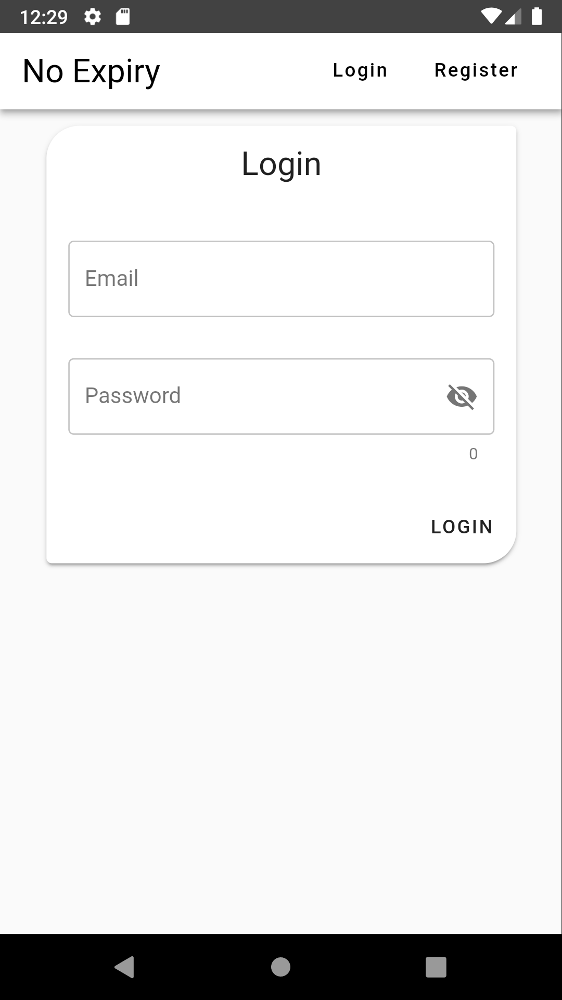
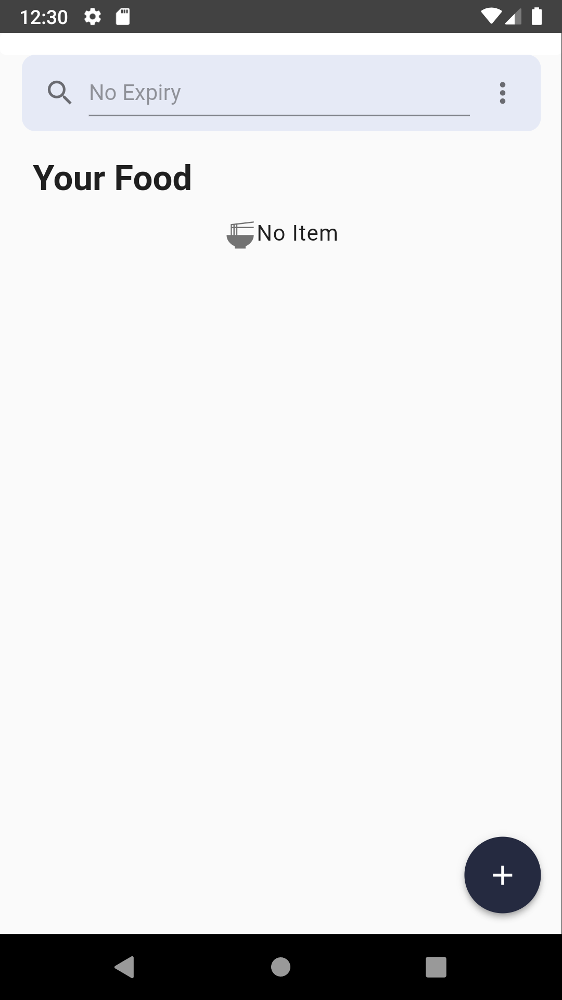
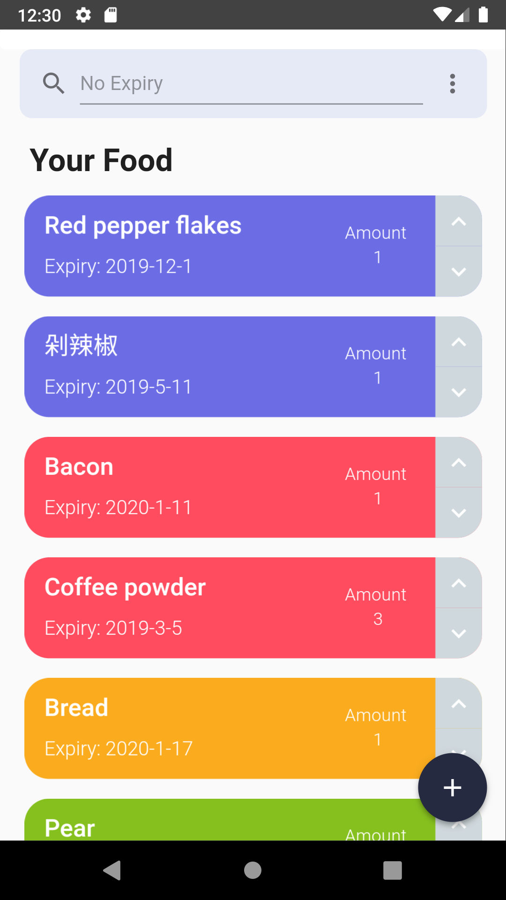
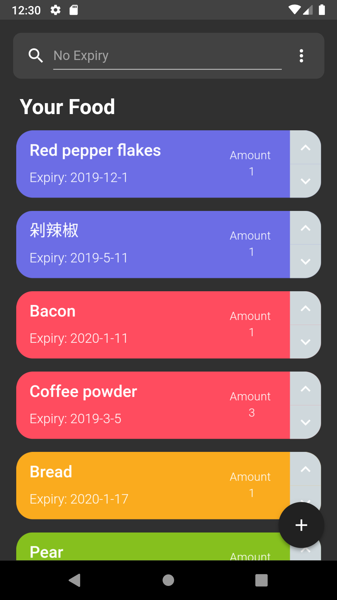
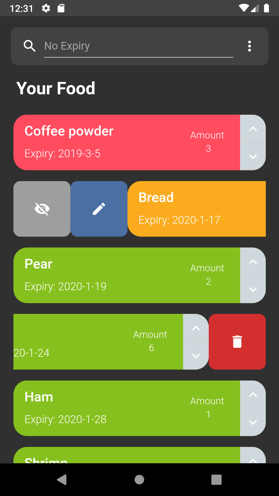
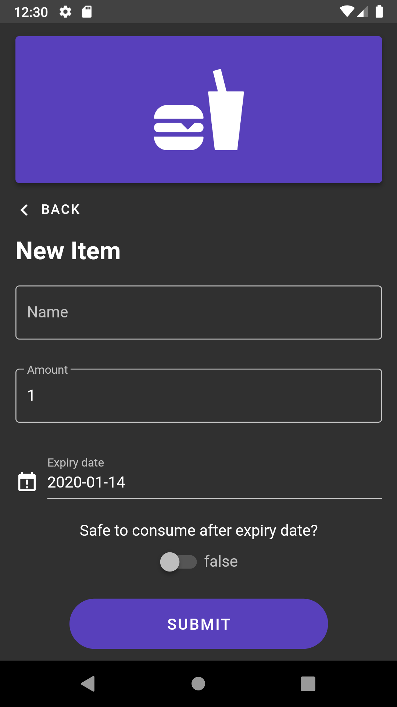
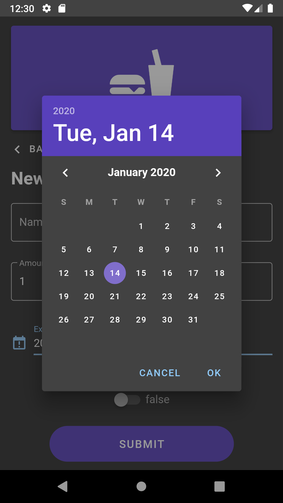

# NoExpiry  
NoExpiry is a mobile-focused web application that aims to keep track of your groceries. 

NoExpiry shows all the groceries that the users have and all their food expiry dates. Users will not buy extra food during grocery shopping as they will know what they already have. Moreover, the application show expiry dates, which can ensure food will eat before the expiration date. Therefore, less food will be wasted.

# Usage
Click [here](https://no-expiry-e8e4c.web.app/) to get started. (p.s. It is still in alpha version, and it is for testing purposes only.)

For now, there are four colours to indicate the expiry date. Indigo suggests the item is expired, but it is still safe to consume. Red means the food already expired and you should either throw it away or eat it if safe. Yellow indicates the item is going to expire in three days, and the user should eat it before it expires. Green shows the thing will not expire anytime soon. Users can also use the search bar to find their specific items.

## Screenshots
||||
| :---: | :---: | :---: |
| Login page | Main page without item | Main page with items|

|||||
| :---: | :---: | :---: | :---: |
| Main page (dark mode) | Swipe to get options | Add item page | Add item page 2|

# Start NoExpiry in dev mode

## Project setup
```
npm install
```

### Compiles and hot-reloads for development
```
npm run serve
```

### Compiles and minifies for production
```
npm run build
```

### Run your unit tests
```
npm run test:unit
```

### Lints and fixes files
```
npm run lint
```

### Customize configuration
See [Configuration Reference](https://cli.vuejs.org/config/).

### Preview before deploy
```
firebase serve
```